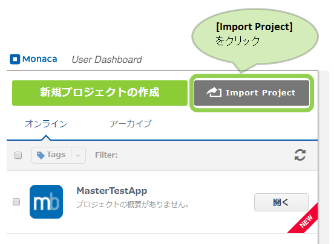
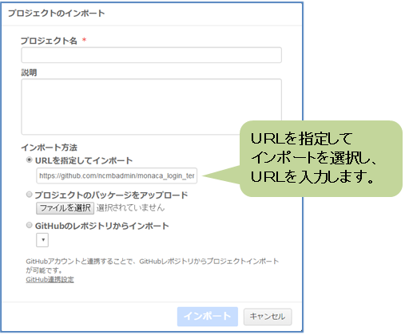
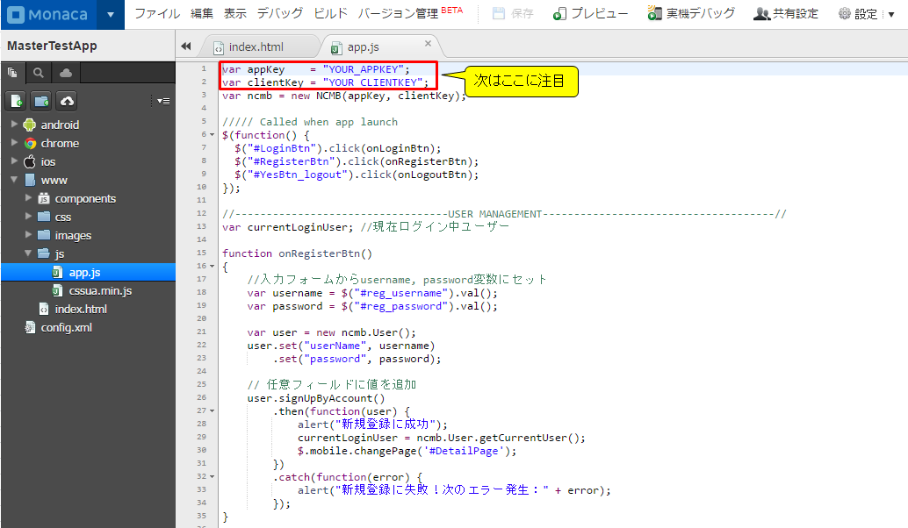
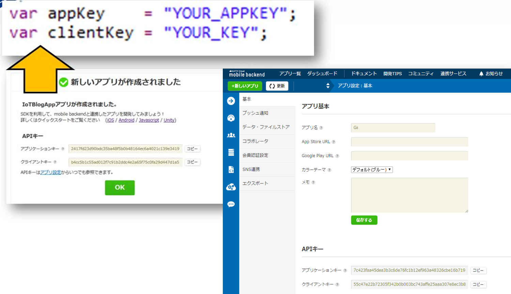

、# Monaca x NIFTYCLOUD mobile backend 会員ログインサンプル

===

# Overview

こちらはMonacaを利用して、mbaasサーバーにログイン機能をつけるサンプルです。
* Android, iOSアプリをHTML, JavaScriptで簡単に作れるツール[Monaca](https://ja.monaca.io/)
* アプリのサーバー機能を簡単に作れるツール[Nifty cloud mobile backend](http://mb.cloud.nifty.com/) (以下からmBaaS)


## Demo

MonacaでgithubのURL(Download zip file)をインポートし、
アプリキーとクライントキーを設定し、アプリを起動（プレビュー）します。

最初にログイン画面が出て、「登録」ボタンを押し、登録画面に行きます。
登録画面にて、「ユーザー名」＋「パスワード」を入力し、ユーザー登録を行います。

ログイン画面に戻り、登録した「ユーザー名」＋「パスワードの組み合わせで」
ログインができることを確認します。

※mBaaS管理画面にて、ユーザー登録されていることを確認できます。

* ユーザー新規登録画面


* ログイン画面


## Description

* コードの説明

File: www/js/app.js

 - 初期化設定

```JavaScript
var appKey    = "YOUR_APPKEY";
var clientKey = "YOUR_CLIENTKEY";

///// Called when app launch
$(function() {
  //ボタン処理実装
  $("#LoginBtn").click(onLoginBtn);
  $("#RegisterBtn").click(onRegisterBtn);
  $("#YesBtn_logout").click(onLogoutBtn);  
  NCMB.initialize(appKey, clientKey);
});
```

上記のコードでキーを指定し、NCMB.initialize(appKey, clientKey), mBaaSサーバーと連携を行います。

 - ユーザ登録

NCMB.Userクラスを利用し、ユーザ登録を行います。

最初にuserという変数をNCMB.Userクラスのインスタンスとして作成、set("key", "value")
というメソッドを利用し、username, passwordをセットします。
会員の他の属性も同様にセットできます。

セット後、signUp()メソッドを利用し、ユーザ登録を非同期に行います。
success, errorそれぞれ場合のコールバック処理を定義してあります。
successの場合、alertを出し、currentLoginUserをセットし、#DetailPageに移動させます。

```JavaScript
//入力フォームからusername, password変数にセット
var username = $("#reg_username").val();
var password = $("#reg_password").val();

var user = new NCMB.User();
user.set("userName", username);
user.set("password", password);

// 任意フィールドに値を追加
user.signUp(null, {
    success: function(user) {
        alert("新規登録に成功");
        currentLoginUser = NCMB.User.current();
        $.mobile.changePage('#DetailPage');
    },
    error: function(user, error) {
        alert("新規登録に失敗！次のエラー発生： " + error.message);
    }
});
```

 - ユーザーログイン

NCMB.Userクラスを利用し、ユーザログインを行います。
NCMB.UserのlogInメソッドを利用し、username, passwordを渡し、
非同期にログインを行います。error, successの場合それぞれコールバックを定義します。
ログイン成功した場合、alertを出し、currentLoginUserをセットし、#DetailPageに移動します。

```JavaScript
var username = $("#login_username").val();
var password = $("#login_password").val();
// ユーザー名とパスワードでログイン
NCMB.User.logIn(username, password, {
    success: function(user) {
        alert("ログイン成功");
        currentLoginUser = NCMB.User.current();
        $.mobile.changePage('#DetailPage');
    },
    error: function(user, error) {
        alert("ログイン失敗！次のエラー発生: " + error.message);
    }
});
```

 - ユーザーログアウト

NCMB.Userクラスを利用し、ユーザログアウトを行います。
NCMB.UserのlogOutメソッドを利用し、username, ログアウトを行います。
ログアウトの後、currentLoginUserをリセットし、#LoginPageに移動します。

```JavaScript
NCMB.User.logOut();
alert('ログアウト成功');
currentLoginUser = null;
$.mobile.changePage('#LoginPage');
```

## Requirement

* Monaca環境
* Nifty cloud mobile backend Javascript SDK version 1.2.6
ダウンロード：[Javascript SDK](http://mb.cloud.nifty.com/doc/current/introduction/sdkdownload_javascript.html)

## Installation

* Monacaで新規アプリ作成し、プロジェクトをインポートする。
  - monacaの利用登録する
    [Monaca](https://ja.monaca.io/)


  - monacaで新規プロジェクトを作成する





* mobile backendでアプリ作成する
  - mobile backendで利用登録する
    [Nifty cloud mobile backend](http://mb.cloud.nifty.com/)


  - mobile backendでアプリ作成する: プロジェクトインポートを選択し、URLからインポートする。
 URLがhttps://github.com/ncmbadmin/monaca_login_template/archive/master.zip
 で選択する。


* monacaで作成したアプリをmobile backendサーバーと連携させる
  - monacaでアプリキー、クライアントキーを設定し、初期化を行う


キーをコピーし、追記します。


  - monacaで動作確認する


## Usage

サンプルコードをカスタマイズする、key, value変数を変更していただきます。
以下のドキュメントを参照し、データ保存・検索・プッシュ通知を入れることができる。
* [ドキュメント](http://mb.cloud.nifty.com/doc/current/)
* [ドキュメント・データストア](http://mb.cloud.nifty.com/doc/current/sdkguide/javascript/datastore.html)
* [ドキュメント・会員管理](http://mb.cloud.nifty.com/doc/current/sdkguide/javascript/user.html)
* [ドキュメント・プッシュ通知](http://mb.cloud.nifty.com/doc/current/sdkguide/javascript/push.html)


## Contributing

1. Fork it!
2. Create your feature branch: `git checkout -b my-new-feature`
3. Commit your changes: `git commit -am 'Add some feature'`
4. Push to the branch: `git push origin my-new-feature`
5. Submit a pull request :D

## License

* MITライセンス
* Nifty cloud mobile backendのJavascript SDKのライセンス
